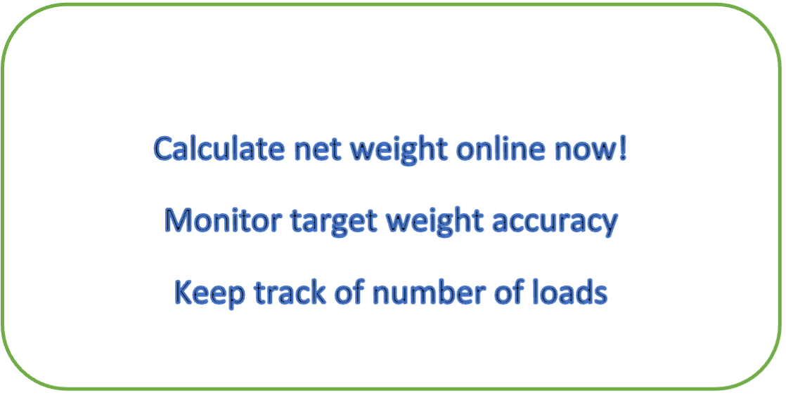
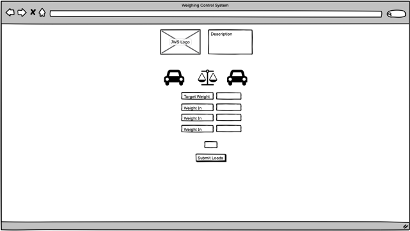

# Weighing Control System

Weighing Control System is a site that allows a user to enter the loaded weight of a vehicle coming into site and the unladen wight of the vehicle leaving site. It then tells the user the net weight of product (loaded weight less unladen weight) that have been delivered to site. The system will alert the user if the weight of the product is with the allowable tolerance of the target weight. It will also keep a tally of number of loads that have entered the site. This will allow the user to monitor the output of goods from their site and ensure security of goods leaving site based on expected weights. 

 

<strong><u>STRATEGY</u></strong>

Focus - What’s worth doing? 
Allow the user to calculate net weight between loaded and unladen trucks coming in and out of site, monitor accuracy and tally loads.   
Definition - What are we creating? 
An easy to use and accessible JavaScript tool that can be used in a browser without any additional software required.   
Value - What value does it provide? 
It provides the user with an error free way of counter checking whether loads entering sites are within tolerance of goods going out of site by taking a reading from the weighing indicator as the loaded truck goes over the incoming weighbridge and taking another reading as the unladen goes over the outgoing weighbridge. 

<strong><u>SCOPE</u></strong>

What features will be available? 
There will be a logo, weighing related images and brief description of what the tool does. There will be input numerical boxes where the user will enter the target weight, loaded truck weight and unladen truck weight. There will also be an output numerical box where the net weight will be calculated. A submit button will alert the user whether the net weight is within the allowable tolerance of the target weight. The submit button will also tally the number of loads coming into site. 

<strong><u>STRUCTURE</u></strong>

How is the user interaction designed? 
At the top of the page will be a JWS logo with a brief description of what it does. Below that there will be two images of trucks left and right to represent the unladen and loaded trucks and an image of a weighing scale in the middle to represent weighing. Underneath the images will be the input and output numerical boxes. Underneath the numerical boxes will be the tally for number of loads and the submit button.

<strong><u>SKELETON</u></strong>

How will the interface be laid out?

 

<strong><u>SURFACE</u></strong>

What will the visual design look like? 
Minimalist theme, white background with the images adding some color. Content will be kept narrowly but evenly spaced to give a clean look.  Will use ariel font which will be black.

<strong><u>FUTURE RELEASES</u></strong>

What features would you like to have in the future? 
Adding registration plates for the trucks and keeping a database of all the corresponding weight readings including an eternal total for the net weight.

<strong><u>TECHNOLOGY</u></strong>

What technology was used? 
Gitpod, GitHub, HTML, CSS, Balsamiq Wireframe.

<strong><u>TESTING</u></strong>

How was the site tested and are there any bugs that have not been addressed? 
HTML – Changed p to b on HTML rows 16, 19, 22 as p cannot be used under h4. No other errors were returned when passing through the official [W3C validator](https://validator.w3.org/nu/?doc=https%3A%2F%2Fcode-institute-org.github.io%2Flove-maths%2F). 
CSS - No errors were found when passing through the official [Jigsaw validator](https://jigsaw.w3.org/css-validator/). 
JavaScript – Added missing semi colons to JS, 1 warning due to unused variable – left in place as required for functioning calculation. No other errors were found when passing through the official [Jshint validator](https://jshint.com/). 
Google Chrome Dev Tools was used to test responsiveness on mobile and tablet devices – all fine.

<strong><u>DEPLOYMENT</u></strong>

How was the project deployed? 
The site was deployed to GitHub pages. The steps to deploy are as follows: 
In the GitHub repository, navigate to the Settings tab. 
Scroll down to the pages option on the left menu and select. 
Select the main branch from the build and deployment section. 
Once the main branch has been selected and the page is refreshed a message is displayed to indicate the successful deployment. 
The live link can be found here - https://code-institute-org.github.io/love-maths/

<strong><u>CREDITS</u></strong>

Code Institute  
Stack Overflow 
John White & Son 
iStock Photos 
Clipart Library

